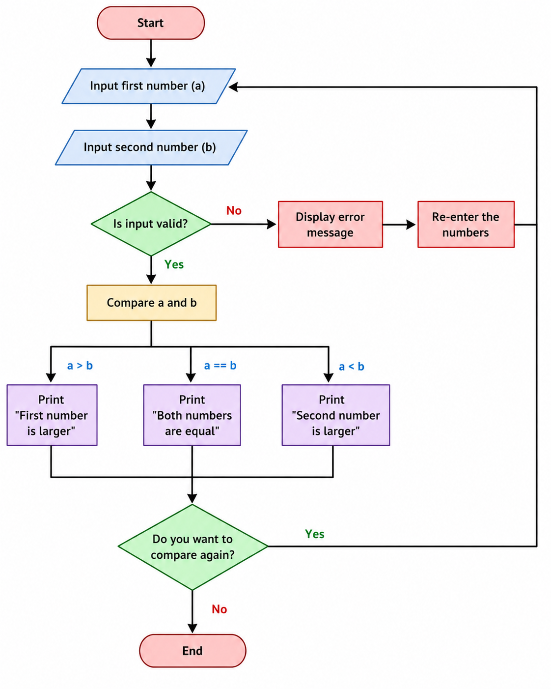
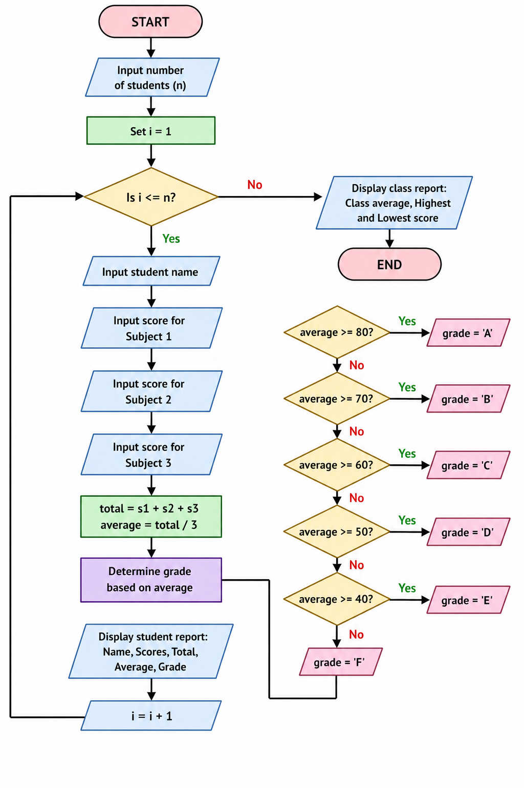
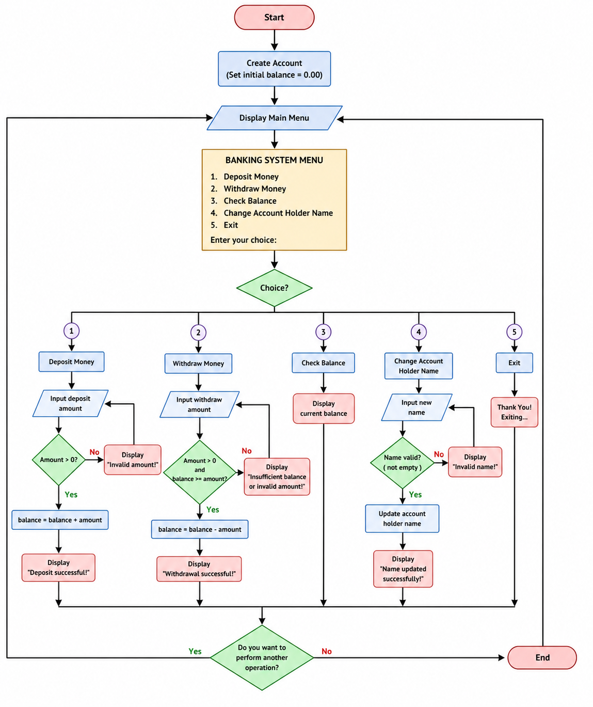

# ✅ **QUESTION 1 — Comparison Program**

## **(i) Flowchart (text form)**



---

## **(ii) C Program (Basic comparison)**

```c
#include <stdio.h>

int main() {
    int a, b;

    printf("Enter first integer: ");
    scanf("%d", &a);

    printf("Enter second integer: ");
    scanf("%d", &b);

    if (a > b) {
        printf("First number is larger\n");
    } else if (b > a) {
        printf("Second number is larger\n");
    } else {
        printf("Both numbers are equal\n");
    }

    return 0;
}
```

---

## **(iii) Input validation using scanf return value**

```c
#include <stdio.h>

int getValidInt(int *num) {
    while (1) {
        if (scanf("%d", num) == 1) {
            return 1;
        } else {
            printf("Invalid input! Enter an integer: ");
            while (getchar() != '\n');
        }
    }
}
```

---

## **(iv) Menu + loop system**

```c
#include <stdio.h>

int getValidInt(int *num) {
    while (scanf("%d", num) != 1) {
        printf("Invalid input! Try again: ");
        while (getchar() != '\n');
    }
    return 1;
}

int main() {
    int a, b, choice, cont;

    do {
        printf("\n1. Compare numbers\n2. Exit\nChoose: ");
        scanf("%d", &choice);

        if (choice == 1) {
            printf("Enter first number: ");
            getValidInt(&a);

            printf("Enter second number: ");
            getValidInt(&b);

            if (a > b)
                printf("First number is larger\n");
            else if (b > a)
                printf("Second number is larger\n");
            else
                printf("Both numbers are equal\n");
        }

        printf("Continue? (1=Yes, 0=No): ");
        scanf("%d", &cont);

    } while (choice != 2 && cont == 1);

    return 0;
}
```

---

## **(v) Function version**

```c
int compareNumbers(int a, int b) {
    if (a > b) return 1;
    else if (b > a) return -1;
    else return 0;
}
```

Usage:

```c
int result = compareNumbers(a, b);
```

---

## ✅ **QUESTION 2** Student Grading System (C Program)



```c
#include <stdio.h>
#include <stdlib.h>
#include <string.h>

#define MAX_STUDENTS 20
#define SUBJECTS 3

// =============================
// Structure Definition
// =============================
typedef struct
{
    char name[50];
    int scores[SUBJECTS];
    int total;
    float average;
    char grade;

} Student;

// =============================
// Function Prototypes
// =============================
char calculateGrade(float average);
void calculateResults(Student *s);
void displayReport(Student students[], int count);

// =============================
// Calculate Grade Function
// =============================
char calculateGrade(float average)
{
    if (average >= 80)
        return 'A';
    else if (average >= 70)
        return 'B';
    else if (average >= 60)
        return 'C';
    else if (average >= 50)
        return 'D';
    else if (average >= 40)
        return 'E';
    else
        return 'F';
}

// =============================
// Calculate Total, Average, Grade
// =============================
void calculateResults(Student *s)
{
    s->total = 0;

    for (int i = 0; i < SUBJECTS; i++)
    {
        s->total += s->scores[i];
    }

    s->average = s->total / 3.0;
    s->grade = calculateGrade(s->average);
}

// =============================
// Display Student Report
// =============================
void displayReport(Student students[], int count)
{
    printf("\n");
    printf("====================================================================================\n");
    printf("%-20s %-10s %-10s %-10s %-10s %-10s %-10s\n",
           "Name", "Sub1", "Sub2", "Sub3", "Total", "Average", "Grade");
    printf("====================================================================================\n");

    for (int i = 0; i < count; i++)
    {
        printf("%-20s %-10d %-10d %-10d %-10d %-10.2f %-10c\n",
               students[i].name,
               students[i].scores[0],
               students[i].scores[1],
               students[i].scores[2],
               students[i].total,
               students[i].average,
               students[i].grade);
    }

    printf("====================================================================================\n");
}

// =============================
// Main Function
// =============================
int main()
{
    Student students[MAX_STUDENTS];

    int numStudents;

    printf("============================================\n");
    printf("      STUDENT GRADING SYSTEM\n");
    printf("============================================\n\n");

    do
    {
        printf("Enter number of students (1-%d): ", MAX_STUDENTS);
        scanf("%d", &numStudents);

        if (numStudents < 1 || numStudents > MAX_STUDENTS)
        {
            printf("[ERROR] Invalid number of students!\n\n");
        }

    } while (numStudents < 1 || numStudents > MAX_STUDENTS);

    getchar(); // clear newline

    // =============================
    // Input Student Data
    // =============================
    for (int i = 0; i < numStudents; i++)
    {
        printf("\n--------------------------------------------\n");
        printf("Student %d\n", i + 1);
        printf("--------------------------------------------\n");

        printf("Enter Student Name: ");
        fgets(students[i].name, sizeof(students[i].name), stdin);

        students[i].name[strcspn(students[i].name, "\n")] = '\0';

        for (int j = 0; j < SUBJECTS; j++)
        {
            do
            {
                printf("Enter Score for Subject %d (0-100): ", j + 1);
                scanf("%d", &students[i].scores[j]);

                if (students[i].scores[j] < 0 || students[i].scores[j] > 100)
                {
                    printf("[ERROR] Score must be between 0 and 100.\n");
                }

            } while (students[i].scores[j] < 0 ||
                     students[i].scores[j] > 100);
        }

        getchar(); // clear newline

        calculateResults(&students[i]);
    }

    // =============================
    // Display Report
    // =============================
    displayReport(students, numStudents);

    // =============================
    // Class Average
    // =============================
    float classAverage = 0;

    for (int i = 0; i < numStudents; i++)
    {
        classAverage += students[i].average;
    }

    classAverage /= numStudents;

    // =============================
    // Highest & Lowest Student
    // =============================
    int highestIndex = 0;
    int lowestIndex = 0;

    for (int i = 1; i < numStudents; i++)
    {
        if (students[i].average > students[highestIndex].average)
        {
            highestIndex = i;
        }

        if (students[i].average < students[lowestIndex].average)
        {
            lowestIndex = i;
        }
    }

    printf("\n");
    printf("============================================\n");
    printf("SUMMARY REPORT\n");
    printf("============================================\n");

    printf("Class Average: %.2f\n\n", classAverage);

    printf("Highest Scoring Student\n");
    printf("Name    : %s\n", students[highestIndex].name);
    printf("Average : %.2f\n\n", students[highestIndex].average);

    printf("Lowest Scoring Student\n");
    printf("Name    : %s\n", students[lowestIndex].name);
    printf("Average : %.2f\n", students[lowestIndex].average);

    printf("\n============================================\n");

    return 0;
}
```

---

## Theory Answers

### a) What is a Structure in C? How is it different from an Array?

A structure (struct) in C is a user-defined data type that allows you to group variables of different data types under a single name.

Definition: A structure is used when you want to store related information together, such as a student's name, age, scores, and grade.

| Structure                             | Array                            |
| ------------------------------------- | -------------------------------- |
| Stores different data types together  | Stores same data type only       |
| Members can be int, float, char, etc. | All elements must be of one type |
| Accessed using `.` operator           | Accessed using index `[ ]`       |
| Example: Student record               | Example: List of scores          |

---

### b) Difference Between Local and Global Variables

| Local Variable                       | Global Variable                        |
| ------------------------------------ | -------------------------------------- |
| Declared inside a function           | Declared outside all functions         |
| Accessible only within that function | Accessible throughout the program      |
| Exists while function executes       | Exists during entire program execution |

---

### c) What is a Function Prototype? Why is it Important?

A function prototype tells the compiler:

- Function name
- Return type
- Number of parameters
- Parameter types

Example:

```c
char calculateGrade(float average);
```

Importance:

- Allows compiler to check function calls.
- Prevents type mismatches.
- Improves code organization.
- Enables functions to be defined later in the program.

---

### Project Features Implemented

✅ Structure `Student`
✅ Array of students (max 20)
✅ Three subject scores
✅ Total calculation
✅ Average calculation
✅ Grade calculation using function
✅ Report generation
✅ Class average
✅ Highest scoring student
✅ Lowest scoring student
✅ Input validation for scores
✅ Proper modular functions
✅ Exam-ready formatting

---

## **QUESTION 3 — Employee System (File Handling)**

## **(ii) Theory**

### a) File handling

Used to store data permanently.

Modes:

- "r" read
- "w" write
- "a" append
- "rb", "wb", "ab" binary modes

---

### b) Text vs Binary

- Text: human readable
- Binary: machine format, faster, secure

---

### c) fopen, fclose, fwrite

- fopen: opens file
- fclose: closes file
- fwrite: writes binary data

---

## **(iii–iv) Program (Core System)**

```c
#include <stdio.h>
#include <string.h>

struct Employee {
    int id;
    char name[100];
    char position[50];
    float salary;
};

void addEmployee() {
    FILE *fp = fopen("emp.dat", "ab");
    struct Employee e;

    printf("ID: ");
    scanf("%d", &e.id);

    printf("Name: ");
    scanf("%s", e.name);

    printf("Position: ");
    scanf("%s", e.position);

    printf("Salary: ");
    scanf("%f", &e.salary);

    fwrite(&e, sizeof(e), 1, fp);
    fclose(fp);
}

void viewEmployees() {
    FILE *fp = fopen("emp.dat", "rb");
    struct Employee e;

    if (!fp) {
        printf("File not found\n");
        return;
    }

    while (fread(&e, sizeof(e), 1, fp)) {
        printf("%d %s %s %.2f\n", e.id, e.name, e.position, e.salary);
    }

    fclose(fp);
}
```

(Search, update, delete follow same pattern using fread + fwrite)

---

## ✅ **QUESTION 2** Banking System (C Program)



---

## **(ii) Theory**

### a) Array

- An _array_ is a collection of elements of the same datatype stored in a contiguous memory location.

```c
 Example: int a[5] = {1,2,3,4,5};
```

---

### b) The difference between `*ptr` vs `&var`

| Feature          | `&var` (Address of variable)       | `*ptr` (Value at address)          |
| ---------------- | ---------------------------------- | ---------------------------------- |
| Meaning          | Gives memory address of a variable | Gives value stored at that address |
| Type             | Address / pointer value            | Dereferenced value                 |
| Usage            | Used to assign address to pointer  | Used to access value via pointer   |
| Example          | `ptr = &a;`                        | `value = *ptr;`                    |
| Operation        | Address operator                   | Dereference operator               |
| Role in pointers | Initializes pointer                | Accesses data through pointer      |

---

### c) The difference between `_while loop_` vs `do-while loop`

| Feature           | `while` loop                             | `do-while` loop                         |
| ----------------- | ---------------------------------------- | --------------------------------------- |
| Condition check   | Checked before loop runs                 | Checked after loop runs                 |
| Minimum execution | May not run at all                       | Runs at least once                      |
| Syntax position   | Condition at top                         | Condition at bottom                     |
| Best use case     | When condition is known before execution | When at least one execution is required |
| Example behavior  | May skip loop                            | Always executes once                    |
| Control style     | Entry-controlled loop                    | Exit-controlled loop                    |

---

## **(iii–iv) Program**

```c
#include <stdio.h>
#include <stdlib.h>
#include <windows.h>
#include <string.h>

#define SIZE 100

void header(char *hdr)
{
   system("cls");
   printf("=======================================\n");
   printf("    %s\n", hdr);
   printf("=======================================\n\n");
}

// Account Structure
typedef struct
{
   int accountNumber;
   char accountHolderName[SIZE];
   float balance;

} Account;

// Deposit Money Function
void depositMoney(Account *acc, float amount)
{
   if (amount <= 0)
   {
      printf("[ERR] Deposit amount must be positive!\n\n");
      system("pause");
      return;
   }

   acc->balance += amount;

   printf("[SUCCESS] Deposit of %.2f GHS successful.\n", amount);
   printf("[INFO] Current Balance: %.2f GHS\n\n", acc->balance);

   system("pause");
}

// Withdraw Money Function
void withdrawMoney(Account *acc, float amount)
{
   if (amount <= 0)
   {
      printf("[ERR] Withdrawal amount must be positive!\n\n");
      system("pause");
      return;
   }

   if (amount > acc->balance)
   {
      printf("[ERR] Insufficient balance!\n");
      printf("[INFO] Current Balance: %.2f GHS\n\n", acc->balance);

      system("pause");
      return;
   }

   acc->balance -= amount;

   printf("[SUCCESS] Withdrawal of %.2f GHS successful.\n", amount);
   printf("Current Balance: %.2f GHS\n\n", acc->balance);

   system("pause");
}

// Check Balance Function
void checkBalance(Account *acc)
{
   printf("=======================================\n");
   printf("          ACCOUNT DETAILS\n");
   printf("=======================================\n");

   printf("Account Number : %d\n", acc->accountNumber);
   printf("Account Holder : %s\n", acc->accountHolderName);
   printf("Balance        : %.2f GHS\n", acc->balance);

   printf("=======================================\n\n");

   system("pause");
}

// Change Account Holder Name
void changeAccountHolderName(Account *acc)
{
   char newName[SIZE];

   while (getchar() != '\n')
      ;

   printf("Enter new account holder name: ");
   fgets(newName, SIZE, stdin);

   newName[strcspn(newName, "\n")] = '\0';

   if (strlen(newName) == 0)
   {
      printf("[ERR] Name cannot be empty!\n\n");
      system("pause");
      return;
   }

   strcpy(acc->accountHolderName, newName);

   printf("[SUCCESS] Account holder name updated successfully!\n\n");

   system("pause");
}

int main()
{
   system("color 0B");

   Account acc;

   // Create Default Account
   acc.accountNumber = 1001;
   strcpy(acc.accountHolderName, "Default User");
   acc.balance = 0.00;

   int choice;
   int cont;
   float amount;

   while (1)
   {
      header("BANKING MANAGEMENT SYSTEM");

      printf("Account Holder : %s\n", acc.accountHolderName);
      printf("Current Balance: %.2f GHS\n\n", acc.balance);

      printf("[1] Deposit Money\n");
      printf("[2] Withdraw Money\n");
      printf("[3] Check Balance\n");
      printf("[4] Change Account Holder Name\n");
      printf("[5] Exit\n\n");

      printf("Choose an option: ");
      scanf("%d", &choice);

      switch (choice)
      {
      case 1:
         header("DEPOSIT MONEY");

         printf("Enter deposit amount: ");
         scanf("%f", &amount);

         depositMoney(&acc, amount);
         break;

      case 2:
         header("WITHDRAW MONEY");

         printf("Enter withdrawal amount: ");
         scanf("%f", &amount);

         withdrawMoney(&acc, amount);
         break;

      case 3:
         checkBalance(&acc);
         break;

      case 4:
         header("CHANGE ACCOUNT HOLDER NAME");

         changeAccountHolderName(&acc);
         break;

      case 5:
         printf("\nThank you for using the Banking System.\n");
         system("pause");
         return 0;

      default:
         printf("\n[ERR] Invalid menu option!\n\n");
         system("pause");
      }

      // Ask user whether to continue
      do
      {
         system("cls");

         printf("Do you want to perform another operation?\n");
         printf("[1] Yes\n");
         printf("[2] No\n\n");

         printf("Enter choice: ");
         scanf("%d", &cont);

         if (cont != 1 && cont != 2)
         {
            printf("\n[ERR] Please enter 1 or 2 only.\n");
            system("pause");
         }

      } while (cont != 1 && cont != 2);

      if (cont == 2)
      {
         printf("\nThank you for using the Banking System.\n");
         system("pause");
         break;
      }
   }

   return 0;
}
```

---

## Add name change feature

```c
void changeName(struct Account *acc) {
    printf("Enter new name: ");
    scanf("%s", acc->accountHolderName);
}
```

---

# ✅ **QUESTION 5 — Functions & Recursion**

## **(ii) Theory**

### a) Function

Reusable block of code.

- Actual parameters: passed in call
- Formal: in function definition

---

### b) Recursion

Function calling itself.

Example:

```c
factorial(n) = n * factorial(n-1)
```

---

### c) Call by value vs reference

- Value: copy passed
- Reference: address passed

---

## **(iii–iv) Program**

```c
#include <stdio.h>
#include <string.h>

int factorial(int n) {
    if (n == 0) return 1;
    return n * factorial(n - 1);
}

void swap(int *a, int *b) {
    int temp = *a;
    *a = *b;
    *b = temp;
}

void reverseString(char str[]) {
    int len = strlen(str);
    for (int i = 0; i < len/2; i++) {
        char temp = str[i];
        str[i] = str[len-i-1];
        str[len-i-1] = temp;
    }
}
```

---

## **(v) Palindrome**

```c
int isPalindrome(char str[]) {
    int len = strlen(str);

    for (int i = 0; i < len/2; i++) {
        if (str[i] != str[len-i-1])
            return 0;
    }
    return 1;
}
```

---
